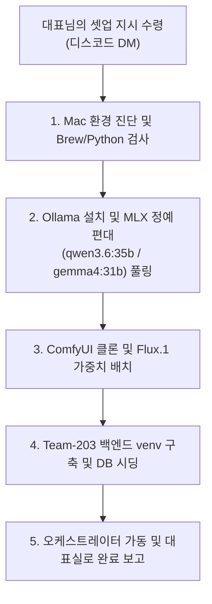

# 💻 M5 Pro Max 대표님 전용 초간편 사옥 시동 가이드 (M5_PRO_MAX_BOOTSTRAP_GUIDE)

본 문서는 대표님 박청룡님의 새로운 최고 성능 장비인 **MacBook Pro M5 Pro Max**가 도착했을 때, 대표님께서는 **단 1줄의 명령어로 PM 에이전트(Hermes)를 최초 설치**하시고, 이후의 복잡한 인프라 설치 및 가동은 **PM 에이전트에게 100% 위임하여 자율 구동**하기 위한 극단적 미니멀리즘 부트스트랩 가이드라인입니다.

이제 대표님이 로컬 터미널에서 수십 줄의 셋업 명령어를 복사 붙여넣기 하실 필요가 없습니다. 회사의 모든 구축 실무는 수석 PM `Hermes`가 M5 Pro Max의 쉘 권한을 획득하여 스스로 집행합니다.

---

## 🎁 [사전 준비: 디스코드 및 AI 인프라 인증 정보 확보 (1분 컷)]

수석 PM `Hermes`가 대표님의 개인 비서로서 작동하고, 사내 건강 지표가 대표실 디스코드 채널로 다이렉트 직송되려면 아래 **딱 2가지 고유 보안 정보**가 필요합니다. 

1. **비상 감사 보고용 웹훅 URL (Discord Webhook URL):**
   - 대표실 디스코드 서버의 알림을 받으실 채널의 **[채널 편집(톱니바퀴)]** ➡️ **[연동(Integrations)]** ➡️ **[웹훅 만들기]**를 눌러 생성된 **`웹훅 URL 복사`**를 클릭해 둡니다.
2. **ComfyUI Flux.1 다운로드용 허깅페이스 토큰 (HuggingFace Token):**
   - ComfyUI에서 최고 화질의 Flux.1 이미지 리소스를 렌더링하기 위해 black-forest-labs의 FLUX.1-dev 라이선스 동의 후 생성한 HuggingFace 토큰을 복사해 둡니다.

*(이 두 값은 절대 Git에 노출되거나 평문 파일로 저장되지 않으며, 아래 초기 3단계를 통해 대표님의 macOS 키체인에 하드웨어 암호화로 안전하게 격리 저장되어 에이전트가 자율 조회합니다.)*

---

## 👔 [대표님 박청룡님이 하실 유일한 초기 5단계]

새로 수령하신 M5 Pro Max에서 AI 에이전트의 완전 자율 비대화형 구동(보안 인증, 백그라운드 자동 깃 푸시 등)을 영구적으로 확보하기 위해, 대표님께서는 최초 1회 아래의 **초간단 5단계**만 집행해 주시면 모든 준비가 완결됩니다.

### 1단계: GitHub로부터 사옥 프로젝트 클론 및 디렉토리 진입 (최초 1회 필수)
터미널(Terminal) 앱을 열고 아래 명령어를 순서대로 실행하여, 보조 워크스페이스 전용 폴더를 생성하고 깃허브로부터 가상 사옥 프로젝트를 안전하게 클론하여 루트 경로로 진입해 주십시오:
```bash
# ① 보조 워크스페이스 전용 디렉토리 생성 및 이동
mkdir -p ~/Documents/workspace && cd ~/Documents/workspace

# ② 깃허브 저장소로부터 Team-203 사옥 프로젝트 격리 클론
git clone https://github.com/ChungRyong/Team-203.git

# ③ 프로젝트 루트 디렉토리 진입
cd Team-203
```

### 2단계: macOS 키체인에 보안 인증 자산 등록 (최초 1회 필수)
터미널에 다음 복사해 둔 2개의 보안 값을 따옴표 안에 넣고 실행해 주십시오. 이 한 줄로 대표님의 보안 정보가 키체인에 안전하게 하드웨어 암호화 보관됩니다.
```bash
# ① 디스코드 비상 웹훅 URL 등록
security add-generic-password -a "Team203" -s "Discord_Webhook_URL" -w "실제_디스코드_웹훅_주소"

# ② 허깅페이스 API 토큰 등록
security add-generic-password -a "Team203" -s "HF_TOKEN" -w "실제_허깅페이스_토큰"
```

### 3단계: Ollama 백그라운드 엔진 가동 및 PM 코어 브레인 모델 사전 다운로드 (최초 1회 필수)
PM 에이전트(`Hermes`)가 정상적으로 깨어나고 작동하려면, 에이전트 런타임 셋업 전에 로컬 추론 엔진인 Ollama가 켜져 있어야 하며 PM의 브레인 역할을 수행할 모델이 로컬에 받아져 있어야 합니다. GUI 앱 유무에 따라 안전하게 자동 분기되어 가동됩니다:
```bash
# ① Ollama 백그라운드 엔진 가동 (GUI 앱 미존재 시 CLI 데몬으로 자율 분기 기동)
if [ -d "/Applications/Ollama.app" ]; then
    open -a Ollama
else
    echo "Ollama GUI 미감지. CLI 백그라운드 데몬(ollama serve)을 기동합니다..."
    nohup ollama serve > /dev/null 2>&1 &
fi

# ② PM Hermes가 깨어날 때 연결할 핵심 추론 모델 사전 다운로드
ollama pull gemma4:31b-mlx || ollama pull gemma2:27b
```

### 4단계: 1줄 시동 명령어로 PM 깨우기
프로젝트 루트 디렉토리(`~/Documents/workspace/Team-203`)에서 다음 **단 1줄의 마스터 커맨드**를 실행해 주십시오.
```bash
curl -fsSL https://hermes-agent.nousresearch.com/install.sh | bash && hermes setup
```
*(이 명령어는 Nous Research의 최첨단 **Hermes Agent** 구동 엔진을 대표님의 맥북에 최초 영구 적재하고 PM Hermes를 영구 비서로 깨우는 초기화 단계입니다. 이미 3단계에서 브레인 모델(`gemma4/gemma2`)이 완비되어 있으므로, 셋업 연동이 한 치의 오류도 없이 완벽하게 동작합니다. 기동 시 `bootstrap.py` 내의 **Keychain Security Resolver**가 위의 키체인 보안 자산을 원터치로 추출하여 로컬 `.env`를 자율적으로 생성/병합합니다.)*

### 5단계: macOS 키체인 접근 제어 항상 허용 세팅 (최초 1회 필수)
백그라운드 샌드박스의 AI 에이전트들이 대표님의 수동 인증 개입 없이 자율적으로 코드를 깃허브 원격지에 안전하게 커밋/푸시할 수 있도록 영구 프리패스 출입증을 발급해 주는 과정입니다.
1. Spotlight(Cmd + Space)를 눌러 **'키체인 접근(Keychain Access)'** 앱을 실행합니다.
2. 우측 상단 검색창에 **`github.com`**을 검색하고, 종류가 **'인터넷 비밀번호'**인 항목을 찾아 **더블 클릭**합니다.
3. 팝업 창 상단의 **[접근 제어 (Access Control)]** 탭으로 이동합니다.
4. **`이 항목을 사용하여 모든 응용 프로그램의 접근 허용 (Allow all applications to access this item)`** 라디오 버튼을 선택합니다.
5. 우측 하단의 **[변경사항 저장]**을 누르고 맥북 암호를 입력해 승인하면 모든 인프라 락이 영구 해제됩니다.

---

## 🤖 [2단계 이후: PM 에이전트에게 위임하기]

위 1단계 명령어가 성공하여 디스코드 DM 또는 터미널을 통해 PM `Hermes`가 연결되면, 대표님께서는 편안하게 의자에 기대어 디스코드 DM으로 **수석 PM에게 다음 한 줄의 마스터 명령만 하달**해 주십시오.

> 💬 **대표님 지시:** 
> `"Hermes, M5 Pro Max 로컬 장비에 Ollama 설치, qwen3.6:35b-mlx 및 gemma4:31b-mlx 최적화 모델들 풀링, ComfyUI 그래픽 엔진 셋업, 백엔드 SQLite 데이터베이스 시딩 및 오케스트레이터 최초 가동까지 전체 사옥 인프라를 자율 프로비저닝(셋업)해라."`
>
> *(기존 4B 경량 모델은 제거하고, 운영 지원 주임 Blinky 역시 PM과 동일한 고품질 **`gemma4:31b-mlx`** 모델을 공유하게 설계하여 VRAM 점유량을 극적으로 줄이면서도 파싱 및 요약 품질을 대폭 끌어올렸습니다!)*

---

## 📊 [PM Hermes의 자율 집행 프로세스 (무인화 진행)]
대표님의 마스터 지시를 수령한 PM `Hermes`는 [PM_AGENT_INFRA_PROVISIONING_GUIDE.md](file:///Users/jabiseu/Documents/workspace/Team-203/PM_AGENT_INFRA_PROVISIONING_GUIDE.md) 매뉴얼을 쉘에서 스스로 독파하여 M5 Pro Max의 터미널을 직접 조작해 다음 업무를 순차 처리합니다.



---

## 📡 [대표실 최종 보고 및 대시보드 검수]
PM `Hermes`가 무인 셋업을 완수하면 대표님의 디스코드 DM으로 새파란 **🏆 [가상 사옥 자율 셋업 완수 보고]** 알림을 전송합니다. 

대표님께서는 편안하게 Obsidian을 켜신 뒤, `workspace/audit/` 폴더 하위에 생성된 당일자 경영 감사 일지(`audit_diary.md`)의 5대 건강성 지표를 흐뭇하게 스캔하시고 자율 오피스 방치(Set-and-Forget) 단계로 진입하시면 모든 부트스트랩 프로세스가 완결됩니다.
