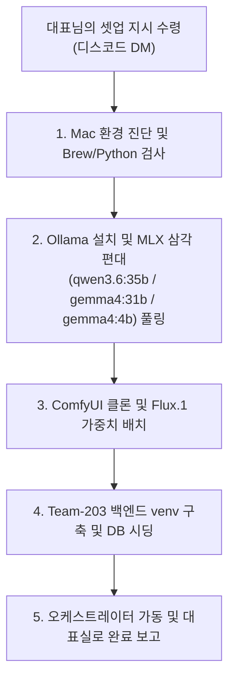

# 💻 M5 Pro Max 대표님 전용 초간편 사옥 시동 가이드 (M5_PRO_MAX_BOOTSTRAP_GUIDE)

본 문서는 대표님 박청룡님의 새로운 최고 성능 장비인 **MacBook Pro M5 Pro Max**가 도착했을 때, 대표님께서는 **단 1줄의 명령어로 PM 에이전트(Hermes)를 최초 설치**하시고, 이후의 복잡한 인프라 설치 및 가동은 **PM 에이전트에게 100% 위임하여 자율 구동**하기 위한 극단적 미니멀리즘 부트스트랩 가이드라인입니다.

이제 대표님이 로컬 터미널에서 수십 줄의 셋업 명령어를 복사 붙여넣기 하실 필요가 없습니다. 회사의 모든 구축 실무는 수석 PM `Hermes`가 M5 Pro Max의 쉘 권한을 획득하여 스스로 집행합니다.

---

## 👔 [대표님 박청룡님이 하실 유일한 1단계]

새로 수령하신 M5 Pro Max의 터미널(Terminal) 앱을 열고 다음 **단 1줄의 커맨드**를 복사해 실행해 주십시오.

```bash
curl -fsSL https://hermes-agent.nousresearch.com/install.sh | bash && hermes setup
```

*(이 명령어는 Nous Research의 최첨단 **Hermes Agent** 구동 엔진을 대표님의 맥북에 최초 영구 적재하고, 대표님의 디스코드 메신저 토큰을 안전하게 바인딩하여 PM Hermes를 영구 비서로 깨우는 유일한 초기화 단계입니다.)*

---

## 🤖 [2단계 이후: PM 에이전트에게 위임하기]

위 1단계 명령어가 성공하여 디스코드 DM 또는 터미널을 통해 PM `Hermes`가 연결되면, 대표님께서는 편안하게 의자에 기대어 디스코드 DM으로 **수석 PM에게 다음 한 줄의 마스터 명령만 하달**해 주십시오.

> 💬 **대표님 지시:** 
> `"Hermes, M5 Pro Max 로컬 장비에 Ollama 설치, qwen3.6:35b-mlx, gemma4:31b-mlx, gemma4:4b-mlx 최적화 모델들 풀링, ComfyUI 그래픽 엔진 셋업, 백엔드 SQLite 데이터베이스 시딩 및 오케스트레이터 최초 가동까지 전체 사옥 인프라를 자율 프로비저닝(셋업)해라."`

---

## 📊 [PM Hermes의 자율 집행 프로세스 (무인화 진행)]
대표님의 마스터 지시를 수령한 PM `Hermes`는 [PM_AGENT_INFRA_PROVISIONING_GUIDE.md](file:///Users/jabiseu/Documents/obsidian-wiki-vault/projects/Team-203/PM_AGENT_INFRA_PROVISIONING_GUIDE.md) 매뉴얼을 쉘에서 스스로 독파하여 M5 Pro Max의 터미널을 직접 조작해 다음 업무를 순차 처리합니다.



---

## 📡 [대표실 최종 보고 및 대시보드 검수]
PM `Hermes`가 무인 셋업을 완수하면 대표님의 디스코드 DM으로 새파란 **🏆 [가상 사옥 자율 셋업 완수 보고]** 알림을 전송합니다. 

대표님께서는 편안하게 Obsidian을 켜신 뒤, `workspace/audit/` 폴더 하위에 생성된 당일자 경영 감사 일지(`audit_diary.md`)의 5대 건강성 지표를 흐뭇하게 스캔하시고 자율 오피스 방치(Set-and-Forget) 단계로 진입하시면 모든 부트스트랩 프로세스가 완결됩니다.
