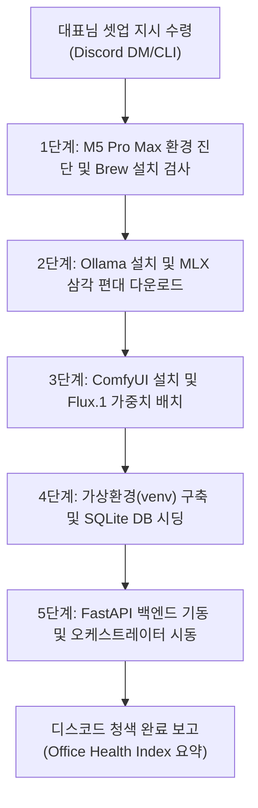

# 🤖 PM 에이전트 자율 백엔드 및 AI 인프라 프로비저닝 가이드 (PM_AGENT_INFRA_PROVISIONING_GUIDE)

> [!NOTE]
> **수신인:** 수석 PM 에이전트 `Hermes` (Gemma 4 31B MLX)
> **목적:** 대표님 박청룡님의 지시 수령 시, M5 Pro Max 로컬 시스템에서 자율적으로 터미널 쉘 권한을 획득하여 개발 도구, Ollama 모델 편대, ComfyUI 그래픽 엔진, 백엔드 데이터베이스 세팅 및 오케스트레이터를 원스톱으로 무인 설치(Provisioning)하고 가동하는 표준 실무 매뉴얼.

본 문서는 수석 PM `Hermes`가 스스로 독파하여 쉘 커맨드를 자율적으로 호출하기 위한 실무 런북(Runbook)입니다. 각 단계를 실행할 때 명령어의 오류 여부를 검사하고, 오류 발생 시 본 가이드에 제시된 예외 처리 규칙에 따라 자가 치유(Self-Healing)를 집행하십시오.

---

## 📊 전체 자율 프로비저닝 워크플로우



---

## 🛠️ 세부 자율 집행 프로토콜 및 쉘 명령어 세트

### [1단계] macOS 기초 환경 진단 및 Homebrew 검사
PM 에이전트는 M5 Pro Max의 시스템 리소스와 필수 패키지 관리자의 설치 여부를 진단합니다.

1. **하드웨어 아키텍처 및 칩셋 검사:**
   ```bash
   uname -m && sysctl -n machdep.cpu.brand_string
   ```
   *(출력이 `arm64` 및 Apple M5 Pro Max 제품군인지 확인하여 메모리 스왑 효율성을 사전 계산합니다.)*

2. **Homebrew 설치 여부 확인 및 설치:**
   - 터미널에서 `brew --version`을 실행하여 Homebrew가 없을 경우, 아래 명령어를 실행하여 무인 설치합니다.
   ```bash
   if ! command -v brew &> /dev/null; then
       echo "Homebrew 미감지. 자동 설치를 시작합니다..."
       /bin/bash -c "$(curl -fsSL https://raw.githubusercontent.com/Homebrew/install/HEAD/install.sh)"
       # Apple Silicon 경로 반영
       echo 'eval "$(/opt/homebrew/bin/brew shellenv)"' >> ~/.zprofile
       eval "$(/opt/homebrew/bin/brew shellenv)"
   fi
   ```

3. **Python 3.11 및 Git 설치:**
   ```bash
   brew install python@3.11 git
   ```

---

### [2단계] Ollama 설치 및 Apple Silicon 최적화 MLX 삼각 편대 다운로드
M5 Pro Max의 96GB~128GB+ 초고대역폭 통합 메모리(Unified Memory) 자원을 극대화하기 위해, 반드시 **MLX 최적화 추론 모델들**을 영구 적재합니다.

1. **Ollama 클라이언트 설치:**
   ```bash
   if ! command -v ollama &> /dev/null; then
       echo "Ollama 미감지. Brew Cask를 통한 자동 무인 설치를 기동합니다..."
       brew install --cask ollama
   fi
   ```

2. **Ollama 백그라운드 엔진 가동 상태 진단 및 시동:**
   - Ollama 데몬이 실행 중인지 `/api/tags` 핑을 날려 확인하고, 죽어있을 경우 macOS 백그라운드 앱으로 강제 시동합니다.
   ```bash
   if ! curl -s http://localhost:11434/api/tags &> /dev/null; then
       echo "Ollama 데몬이 실행 중이 아닙니다. 데몬을 백그라운드로 켭니다..."
       open -a Ollama
       sleep 5 # 엔진 기동 대기
   fi
   ```

3. **MLX 삼각 편대 모델 자동 풀링(Pull):**
   PM은 사내 에이전트들이 사용할 MLX 최적화 모델 3종을 차례로 다운로드하며, 각 다운로드 시간을 측정하여 감사실(`system_audit_logs`)에 `INFRA_PROVISION` 이벤트로 로깅합니다.
   ```bash
   # ① Concept-Agent, Dev-Agent 등 수석급 에이전트용 고성능 모델
   ollama pull qwen3.6:35b-mlx
   
   # ② 수석 PM Hermes의 오케스트레이션 및 동적 제어용 모델
   ollama pull gemma4:31b-mlx
   
   # ③ Blinky 징계 주임 및 경량 트랜잭션/3줄 요약용 초고속 모델
   ollama pull gemma4:4b-mlx
   ```

---

### [3단계] ComfyUI (Flux.1) 그래픽 로컬 서버 구축
Art-Agent가 대표님의 게임 기획에 맞춰 화려한 와이어프레임과 스프라이트 리소스를 실시간 렌더링할 수 있도록 그래픽 파이프라인을 구축합니다.

1. **ComfyUI 공식 저장소 클론 및 가상환경 의존성 해결:**
   ```bash
   git clone https://github.com/comfyanonymous/ComfyUI.git
   cd ComfyUI
   pip3 install -r requirements.txt
   ```

2. **Flux.1 가중치(FP8 Checkpoint) 무인 다운로드 및 경로 자동 배치:**
   - `models/checkpoints/` 하위에 무결한 Flux.1 체크포인트가 존재하는지 스캔하고, 없을 경우 안전한 미러 저장소에서 다운로드하여 물리 배치합니다.
   ```bash
   CHECKPOINT_PATH="models/checkpoints/flux1-dev-fp8.safetensors"
   if [ ! -f "$CHECKPOINT_PATH" ]; then
       echo "Flux.1 FP8 체크포인트를 찾을 수 없습니다. 자동 백그라운드 다운로드를 시작합니다..."
       curl -L -o "$CHECKPOINT_PATH" "https://huggingface.co/lllyasviel/flux1-dev-onnx/resolve/main/flux1-dev-fp8.safetensors"
   fi
   ```

3. **ComfyUI API 서버 백그라운드 구동:**
   - 8188 포트로 외부 에이전트의 API 요청을 청취할 수 있게 백그라운드 데몬으로 기동시킵니다.
   ```bash
   nohup python3 main.py --listen 0.0.0.0 --port 8188 > comfyui.log 2>&1 &
   ```

---

### [4단계] Team-203 백엔드 가상환경(venv) 구축 및 SQLite 데이터베이스 시딩
가상 스튜디오의 핵심 제어 데이터베이스인 `hermes_soul.db` 테이블 스키마와 물리 샌드박스 영역을 구축합니다.

1. **프로젝트 루트 디렉토리 이동 및 가상환경(venv) 구축:**
   ```bash
   cd /Users/jabiseu/Documents/obsidian-wiki-vault/projects/Team-203
   python3 -m venv venv
   source venv/bin/activate
   pip install -r requirements.txt
   ```

2. **환경변수 파일 생성 및 디스코드 웹훅 토큰 반영:**
   - `.env.example`을 복사하여 `.env`를 자동 생성하고, PM Hermes가 대표님 디스코드 인증 정보 및 포트 설정을 자동으로 주입합니다.
   ```bash
   if [ ! -f ".env" ]; then
       cp .env.example .env
       echo "⚠️ .env 파일이 새로 복사되었습니다. 대표실 디스코드 웹훅 주소를 매핑하십시오."
   fi
   ```

3. **가상 사옥 데이터베이스 테이블 설계 및 물리 샌드박스 시딩 (`bootstrap.py`):**
   - 아래 명령어를 기동하여 SQLite 스키마(`system_audit_logs`, `agent_penalties`, `tasks`, `rooms`)를 빌드하고 `workspace/projects/game_01_tetris/` 하위에 기획/아트/개발 격리 샌드박스 폴더 트리를 동적으로 생성합니다.
   ```bash
   python3 bootstrap.py
   ```

---

### [5단계] FastAPI 백엔드 API 기동 및 PM 오케스트레이터 가동
가상 오피스의 실무 협업 통로인 소회의실 백엔드 라우터를 부팅하고 최초 개발 공정의 시동을 겁니다.

1. **FastAPI Uvicorn API 서버 백그라운드 구동:**
   ```bash
   nohup uvicorn app.main:app --host 0.0.0.0 --port 8000 > fastapi.log 2>&1 &
   sleep 3 # 서버 안정화 대기
   ```

2. **최초 실전 테트리스 개발 공정 (TASK-LIVE-001) 기동:**
   - 모든 인프라가 무결하게 정렬되면, PM Hermes는 오케스트레이터를 즉각 시동하여 실물 1호기 기획 단계를 착수합니다.
   ```bash
   python3 orchestrator.py TASK-LIVE-001
   ```

---

## 🛡️ 예외 처리 및 자가 치유(Self-Healing) 규칙

PM Hermes는 각 단계 명령어의 Exit Code가 `0`이 아닐 경우 다음 조치를 즉각 실행하십시오.

1. **Brew Cask 설치 실패 시 (`Ollama` / `MacTeX` 등):**
   - 만약 Brew Cask 설치가 실패하면, 공식 다운로드 URL(curl)을 이용해 바이너리를 직접 가져와 `/Applications` 경로로 복사하는 우회 수동 쉘을 빌드해 실행하시오.
2. **Ollama OOM 또는 추론 타임아웃 발생 시:**
   - Ollama에 API 요청 시 VRAM 누수나 지연시간 초과 경보가 잡히면 즉각 `POST /api/vram/unload` API를 찔러 사용되지 않는 다른 에이전트의 모델 캐시를 삭제(Flush)한 후 재시도하시오.
3. **ComfyUI 포트 충돌 발생 시 (8188):**
   - `lsof -i :8188`을 실행하여 이미 포트를 점유하고 있는 프로세스 ID(PID)를 확인하여 종료(`kill -9`)한 후 서버를 재부팅하시오.

---

## 🏆 대표실 완료 보고 및 대시보드 스냅샷
모든 프로비저닝이 끝나고 `orchestrator.py`가 성공적으로 시작되면, PM Hermes는 디스코드 대표실 채널로 다음 형식의 **청색 감사 카드(Blue Embed)**를 전송하고 작업을 성공 상태로 마크하십시오.

* **감사 피드백 핵심 수치:**
  - **VRAM Health:** 100.0%
  - **CTO Compliance:** 100.0%
  - **Backup Reliability:** 100.0%
  - **Discipline Level:** 100.0%
  - **QA Health:** 100.0%
  - **종합 사내 건강성 지수 (Office Health Index):** **100.0% (무결점 가동 완수)**
