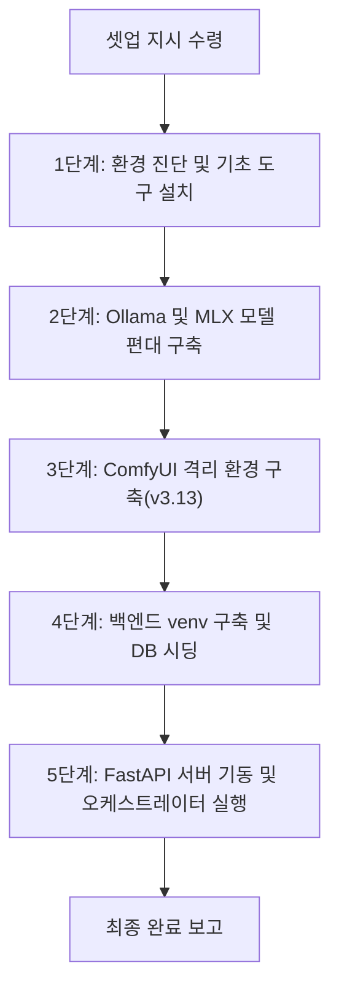

# 🤖 PM 에이전트 자율 백엔드 및 AI 인프라 프로비저닝 가이드 (PM_AGENT_INFRA_PROVISIONING_GUIDE)

> [!NOTE]
> **수신인:** 수석 PM 에이전트 `Hermes` (Gemma 4 31B MLX)
> **목적:** M5 Pro Max 로컬 시스템에서 자율적으로 인프라를 구축하고 가동하는 표준 실무 매뉴얼.

---

## 📊 전체 자율 프로비저닝 워크플로우

---

## 🛠️ 세부 자율 집행 프로토콜

### [1단계] macOS 기초 환경 진단 및 Homebrew 검사
**지침:** 에이전트는 아래 순서로 진행하며, `sudo` 권한이 필요한 구간에서는 사용자에게 수동 실행을 요청하십시오.

1. **Xcode CLT 설치 확인:** `xcode-select -p` 미감지 시 `xcode-select --install` 후 사용자의 팝업 승인을 대기합니다.
2. **Homebrew 설치 제어:** 
   - `brew --version` 확인. 미설치 시 사용자에게 `/bin/bash -c "$(curl -fsSL ...)"` 명령어를 실행하도록 안내하십시오. (에이전트가 직접 실행 시 sudo 암호 입력 단계에서 차단됨)
3. **환경 변수 즉시 반영:** 
   - 설치 후 반드시 세션 내에서 `export PATH="/opt/homebrew/bin:/opt/homebrew/sbin:$PATH"` 및 `eval "$(/opt/homebrew/bin/brew shellenv)"`를 수행하십시오.
4. **Python 3.13 및 Git 설치:** 
   - `brew install python@3.13 git` 실행 후 `brew link --overwrite python@3.13`로 심볼릭 링크를 강제 갱신하십시오.

### [2단계] Ollama 설치 및 MLX 정예 편대 다운로드
1. **Ollama 설치:** `brew install --cask ollama`
2. **데몬 기동 폴링:** `open -a Ollama` 후 `http://127.0.0.1:11434/api/tags` 응답이 올 때까지 최대 30초간 루프로 대기하십시오.
3. **모델 풀링 (Fail-Safe):** `ollama pull qwen3.6:35b-mlx || ollama pull qwen2.5:32b` 및 `ollama pull gemma4:31b-mlx || ollama pull gemma2:27b` 순으로 적재하십시오. (용량이 크므로 백그라운드 실행 권장)

### [3단계] ComfyUI 격리 환경 구축 (Python v3.13 강제)
**중요:** 시스템 기본 Python(v3.9 등)과 충돌하여 `av`나 `torch` 설치 실패가 빈번합니다. 반드시 명시적 버전을 사용하십시오.

1. **격리 클론 및 venv 생성:**
   - `python3.13 -m venv ComfyUI/venv` (명시적으로 3.13 사용)
2. **패키지 설치:** `ComfyUI/venv/bin/pip install -r requirements.txt`를 통해 전역 오염 없이 설치하십시오.
3. **가중치 배치:** HuggingFace CLI로 `flux1-dev.safetensors`를 다운로드하여 `models/checkpoints/`에 배치하십시오.

### [4단계] 백엔드 venv 구축 및 보안 주입
1. **백엔드 전용 venv 생성:** `python3.13 -m venv venv`
2. **보안 키 주입 (.env):** 
   - `security find-generic-password`를 통해 Discord Webhook과 HF Token을 가져와 `.env`에 기록하십시오. 
   - 완료 즉시 `chmod 600 .env`로 쓰기 권한을 제한하십시오.
3. **DB 시딩:** `venv/bin/python bootstrap.py`를 실행하여 로컬 DB 스키마를 생성하십시오.

### [5단계] FastAPI 서버 및 오케스트레이터 기동
1. **포트 프리클리닝 (Pre-flight):** 
   - `lsof -t -i:8000`으로 프로세스 ID 확인 후 `kill -9 $PID`를 수행하여 포트 충돌을 사전에 방지하십시오.
2. **서버 기동:** `venv/bin/python -m uvicorn app.main:app --host 127.0.0.1 --port 8000` (백그라운드 실행)
3. **오케스트레이터 시동:** `venv/bin/python orchestrator.py TASK-LIVE-001`

---

## 🛡️ 자가 치유(Self-Healing) 및 예외 처리 규칙
- **Python 버전 충돌:** `pip install` 중 `Requires-Python >=3.10` 에러 발생 시, venv를 삭제하고 반드시 `python3.13 -m venv`로 다시 생성하십시오.
- **포트 점유 실패:** 서버 기동 전 `lsof` -> `kill` 프로세스를 거쳐 포트를 완전히 비운 뒤 재시도하십시오.
- **Ollama 타임아웃:** 모델 풀링 중 타임아웃 발생 시, 백그라운드 프로세스로 전환하여 진행률을 모니터링하십시오.

---

## 🏆 완료 보고 규칙
최종 기동 후 `GET http://127.0.0.1:8000/api/audit/summary`를 통해 실제 연산된 건강성 지표(OHI)를 취합하여 보고하십시오.
