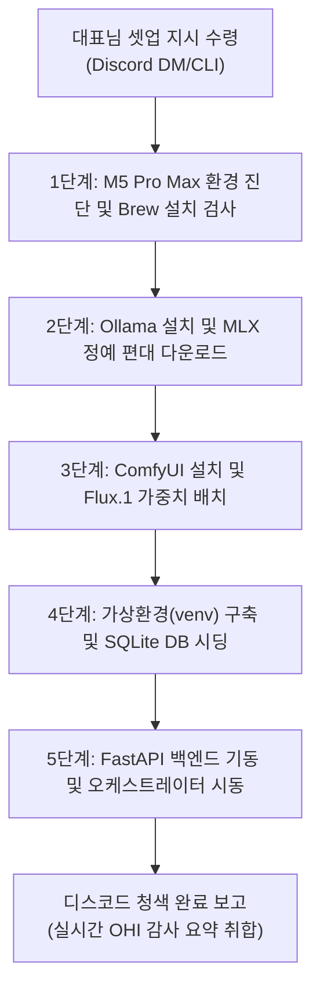

# 🤖 PM 에이전트 자율 백엔드 및 AI 인프라 프로비저닝 가이드 (PM_AGENT_INFRA_PROVISIONING_GUIDE)

> [!NOTE]
> **수신인:** 수석 PM 에이전트 `Hermes` (Gemma 4 31B MLX)
> **목적:** 대표님 박청룡님의 지시 수령 시, M5 Pro Max 로컬 시스템에서 자율적으로 터미널 쉘 권한을 획득하여 개발 도구, Ollama 모델 편대, ComfyUI 그래픽 엔진, 백엔드 데이터베이스 세팅 및 오케스트레이터를 원스톱으로 무인 설치(Provisioning)하고 가동하는 표준 실무 매뉴얼.

본 문서는 수석 PM `Hermes`가 스스로 독파하여 쉘 커맨드를 자율적으로 호출하기 위한 실무 런북(Runbook)입니다. 각 단계를 실행할 때 명령어의 오류 여부를 검사하고, 오류 발생 시 본 가이드에 제시된 예외 처리 규칙에 따라 자가 치유(Self-Healing)를 집행하십시오.

---

## 📊 전체 자율 프로비저닝 워크플로우



---

## 🛠️ 세부 자율 집행 프로토콜 및 쉘 명령어 세트

### [1단계] macOS 기초 환경 진단 및 Homebrew 검사
PM 에이전트는 M5 Pro Max의 시스템 리소스와 필수 패키지 관리자의 설치 여부를 진단합니다.

1. **하드웨어 아키텍처 및 칩셋 검사:**
   ```bash
   uname -m && sysctl -n machdep.cpu.brand_string
   ```
   *(출력이 `arm64` 및 Apple M5 Pro Max 제품군인지 확인하여 메모리 스왑 효율성을 사전 계산합니다.)*

2. **Homebrew 설치 여부 확인 및 설치:**
   - 터미널에서 `brew --version`을 실행하여 Homebrew가 없을 경우, 아래 명령어를 실행하여 무인 설치합니다.
   ```bash
   if ! command -v brew &> /dev/null; then
       echo "Homebrew 미감지. 자동 설치를 시작합니다..."
       /bin/bash -c "$(curl -fsSL https://raw.githubusercontent.com/Homebrew/install/HEAD/install.sh)"
       # Apple Silicon 경로 반영
       echo 'eval "$(/opt/homebrew/bin/brew shellenv)"' >> ~/.zprofile
       eval "$(/opt/homebrew/bin/brew shellenv)"
   fi
   ```

3. **Python 및 Git 설치:**
   - 현재 개발 환경 기준 Python 3.13을 사용합니다. `python@3.11`로 고정하면 신규 장비에서 버전 불일치가 발생할 수 있습니다.
   ```bash
   brew install python@3.13 git
   # Apple Silicon 심볼릭 링크 갱신
   brew link --overwrite python@3.13
   ```

---

### [2단계] Ollama 설치 및 Apple Silicon 최적화 MLX 정예 편대 다운로드
M5 Pro Max의 96GB~128GB+ 초고대역폭 통합 메모리(Unified Memory) 자원을 극대화하기 위해, 불필요한 중복 로딩을 피하고 **단 2종의 핵심 MLX 최적화 추론 모델**을 로컬에 영구 적재합니다.

1. **Ollama 클라이언트 설치:**
   ```bash
   if ! command -v ollama &> /dev/null; then
       echo "Ollama 미감지. Brew Cask를 통한 자동 무인 설치를 기동합니다..."
       brew install --cask ollama
   fi
   ```

2. **Ollama 백그라운드 엔진 가동 상태 진단 및 결정적 폴링(Polling) 시동:**
   - Ollama 데몬을 켠 뒤, 고정 지연(sleep) 대신 최대 30초 동안 API가 활성화될 때까지 루프로 결정적 폴링을 수행합니다.
   ```bash
   if ! curl -s http://localhost:11434/api/tags &> /dev/null; then
       echo "Ollama 데몬이 실행 중이 아닙니다. 데몬을 백그라운드로 켭니다..."
       open -a Ollama
       
       # 결정적 폴링 기동 (최대 30초)
       TIMEOUT=30
       while [ $TIMEOUT -gt 0 ]; do
           if curl -s http://localhost:11434/api/tags &> /dev/null; then
               echo "Ollama 데몬 활성화 확인 완료."
               break
           fi
           echo "Ollama 데몬 대기 중... (${TIMEOUT}초 남음)"
           sleep 1
           let TIMEOUT--
       done
       
       if [ $TIMEOUT -eq 0 ]; then
           echo "❌ Ollama 데몬 부팅 대기 시간 초과. 프로비저닝을 즉각 중단합니다."
           exit 1
       fi
   fi
   ```

3. **MLX 정예 편대 모델 자동 풀링(Pull) 및 태그명 검증:**
   - PM은 에이전트들이 사용할 MLX 최적화 모델 2종을 차례로 다운로드하며, 각 다운로드 시간을 측정하여 감사실(`system_audit_logs`)에 `INFRA_PROVISION` 이벤트로 로깅합니다.
   - 로컬 커스텀 MLX 모델 가중치 임포트가 누락된 빌드 환경에서는, Ollama 공식 라이브러리 검증 모델(`qwen2.5:32b` 또는 `gemma2:27b` 등)을 대체 우선순위로 확보하여 Fail-Safe를 달성합니다.
   ```bash
   # ① Concept-Agent, Dev-Agent 등 수석급 에이전트용 고성능 코딩 모델
   ollama pull qwen3.6:35b-mlx || ollama pull qwen2.5:32b
   
   # ② 수석 PM Hermes의 오케스트레이션 및 Blinky 요약 공용 핵심 추론 모델
   ollama pull gemma4:31b-mlx || ollama pull gemma2:27b
   ```

---

### [3단계] ComfyUI (Flux.1) 그래픽 로컬 서버 구축 (격리 가상환경 및 클론 경로 명시)
Art-Agent가 대표님의 게임 기획에 맞춰 화려한 와이어프레임과 스프라이트 리소스를 실시간 렌더링할 수 있도록 그래픽 파이프라인을 격리하여 구축합니다.

1. **ComfyUI 격리 클론 및 전용 가상환경(venv) 구축:**
   - 전역 라이브러리 오염을 원천 차단하기 위해, 반드시 **Team-203 프로젝트 산하의 지정된 서브 디렉토리**에 클론하고 전용 가상환경을 활성화하여 패키지를 설치합니다.
   ```bash
   # 1. 사옥 프로젝트 폴더로 이동 및 격리 클론
   cd /Users/jabiseu/Documents/workspace/Team-203
   git clone https://github.com/comfyanonymous/ComfyUI.git
   
   # 2. ComfyUI 전용 격리 venv 생성 및 활성화
   python3 -m venv ComfyUI/venv
   source ComfyUI/venv/bin/activate
   
   # 3. 격리된 환경에 의존성 라이브러리 설치
   pip install --upgrade pip
   pip install -r ComfyUI/requirements.txt
   deactivate # ComfyUI 의존성 영역 탈출
   ```

2. **Flux.1 가중치(FP8 Checkpoint) 무인 다운로드 및 경로 자동 배치:**
   - `ComfyUI/models/checkpoints/` 하위에 무결한 Flux.1 체크포인트가 존재하는지 스캔하고, 없을 경우 HuggingFace CLI를 통해 인증 후 다운로드합니다.
   - ⚠️ **Flux.1-dev는 HuggingFace Gated Model**입니다. 라이선스 동의 및 토큰 인증 없이 `curl` 직접 다운로드 시 **403 오류**가 발생합니다. 반드시 아래 순서를 준수하십시오.
   ```bash
   cd /Users/jabiseu/Documents/workspace/Team-203/ComfyUI
   
   # ① huggingface_hub 설치 (CLI 도구 확보)
   pip3 install -q huggingface_hub
   
   # ② HuggingFace 토큰 인증 (대표님 HF_TOKEN 환경변수 또는 직접 입력)
   #    사전에 https://huggingface.co/black-forest-labs/FLUX.1-dev 에서 라이선스 동의 필수
   huggingface-cli login --token "$HF_TOKEN"
   
   # ③ 체크포인트 존재 여부 확인 후 다운로드
   CHECKPOINT_PATH="models/checkpoints/flux1-dev.safetensors"
   if [ ! -f "$CHECKPOINT_PATH" ]; then
       echo "Flux.1 체크포인트를 찾을 수 없습니다. HuggingFace에서 인증 다운로드를 시작합니다..."
       huggingface-cli download black-forest-labs/FLUX.1-dev \
           flux1-dev.safetensors \
           --local-dir models/checkpoints/
   else
       echo "✅ Flux.1 체크포인트 이미 존재. 다운로드를 건너뜁니다."
   fi
   
   cd ..
   ```

3. **ComfyUI API 서버 백그라운드 구동:**
   ```bash
   source ComfyUI/venv/bin/activate
   nohup python3 ComfyUI/main.py --listen 0.0.0.0 --port 8188 > ComfyUI/comfyui.log 2>&1 &
   deactivate
   ```

---

### [4단계] Team-203 백엔드 가상환경(venv) 구축 및 SQLite 데이터베이스 시딩
가상 스튜디오의 핵심 제어 데이터베이스인 `hermes_soul.db` 테이블 스키마와 물리 샌드박스 영역을 구축합니다.

1. **프로젝트 루트 디렉토리 이동 및 가상환경(venv) 구축:**
   ```bash
   cd /Users/jabiseu/Documents/workspace/Team-203
   python3 -m venv venv
   source venv/bin/activate
   pip install -r requirements.txt
   ```

2. **macOS Keychain(키체인) 기반의 하드웨어 보안 키 주입 및 .env 자동 생성:**
   - ⚠️ **민감한 보안 정보 유출 방지 조치:** Discord Webhook URL 및 HuggingFace Token과 같은 중요 인증키는 소스코드나 텍스트 파일에 노출하지 않고, macOS의 키체인에 하드웨어 암호화로 격리 보관합니다.
   - 대표님께서는 새 맥북 수령 후 아래 2개의 명령어를 터미널에서 최초 1회 직접 입력해 두시기만 하면 됩니다:
     ```bash
     # ① 디스코드 알림용 웹훅 주소를 키체인에 안전하게 등록
     security add-generic-password -a "Team203" -s "Discord_Webhook_URL" -w "실제_디스코드_웹훅_주소"
     
     # ② ComfyUI Flux.1 다운로드용 HF Token을 키체인에 안전하게 등록
     security add-generic-password -a "Team203" -s "HF_TOKEN" -w "실제_허깅페이스_토큰"
     ```
   - 이 가이드를 숙지한 PM Hermes와 `bootstrap.py`는 기동 시 자동으로 아래 쉘 명령어를 자율 호출하여 키체인에서 안전하게 인증 정보를 조회하고, 로컬의 `.env`를 자동으로 완전 병합/생성합니다:
     ```bash
     # 키체인에서 Discord Webhook URL 및 HF_TOKEN을 원터치로 파싱하여 .env에 임포트
     DISCORD_URL=$(security find-generic-password -a "Team203" -s "Discord_Webhook_URL" -w)
     HF_VAL=$(security find-generic-password -a "Team203" -s "HF_TOKEN" -w)
     
     cp .env.example .env
     sed -i '' "s|DISCORD_WEBHOOK_URL=.*|DISCORD_WEBHOOK_URL=$DISCORD_URL|g" .env
     sed -i '' "s|HF_TOKEN=.*|HF_TOKEN=$HF_VAL|g" .env
     ```

3. **가상 사옥 데이터베이스 테이블 설계 및 물리 샌드박스 시딩 (`bootstrap.py`):**
   ```bash
   python3 bootstrap.py
   ```

---

### [5단계] FastAPI 백엔드 API 기동 및 PM 오케스트레이터 가동
가상 오피스의 실무 협업 통로인 소회의실 백엔드 라우터를 부팅하고 최초 개발 공정의 시동을 겁니다.

1. **FastAPI Uvicorn API 서버 백그라운드 구동 및 API 결정적 폴링:**
   ```bash
   nohup uvicorn app.main:app --host 0.0.0.0 --port 8000 > fastapi.log 2>&1 &
   
   # FastAPI 포트 개방 결정적 폴링 (최대 30초)
   TIMEOUT=30
   while [ $TIMEOUT -gt 0 ]; do
       if curl -s http://localhost:8000/api/tasks &> /dev/null; then
           echo "FastAPI 백엔드가 성공적으로 가동되었습니다."
           break
       fi
       echo "FastAPI 백엔드 대기 중... (${TIMEOUT}초 남음)"
       sleep 1
       let TIMEOUT--
   done
   
   if [ $TIMEOUT -eq 0 ]; then
       echo "❌ FastAPI 백엔드 시동 시간 초과. 가동을 취소합니다."
       exit 1
   fi
   ```

2. **최초 실전 테트리스 개발 공정 (TASK-LIVE-001) 기동:**
   ```bash
   python3 orchestrator.py TASK-LIVE-001
   ```

---

## 🛡️ 예외 처리 및 우아한 자가 치유(Graceful Self-Healing) 규칙

PM Hermes는 각 단계 명령어의 Exit Code가 `0`이 아닐 경우 다음 조치를 즉각 실행하십시오.

1. **Brew Cask 설치 실패 시 (`Ollama` / `MacTeX` 등):**
   - 만약 Brew Cask 설치가 실패하면, 공식 다운로드 URL(curl)을 이용해 바이너리를 직접 가져와 `/Applications` 경로로 복사하는 우회 수동 쉘을 빌드해 실행하시오.
2. **Ollama OOM 또는 추론 타임아웃 발생 시:**
   - Ollama에 API 요청 시 VRAM 누수나 지연시간 초과 경보가 잡히면 즉각 `POST /api/vram/unload` API를 찔러 사용되지 않는 다른 에이전트의 모델 캐시를 삭제(Flush)한 후 재시도하시오.
3. **ComfyUI 포트 충돌 발생 시 (8188) - 우아한 프로세스 강제 종료:**
   - 포트 충돌 감지 시, 즉각 강제 종료(`kill -9`)를 날리지 말고 **SIGTERM(기본 kill) 호출 및 3초 대기** 후, 종료되지 않을 때만 마지막 수단으로 SIGKILL(`kill -9`)을 실행하시오.
   ```bash
   PID=$(lsof -t -i:8188)
   if [ ! -z "$PID" ]; then
       echo "포트 8188에 ComfyUI 중복 프로세스 감지 (PID: $PID). 우아하게 종료를 요청합니다..."
       kill $PID
       sleep 3
       
       if kill -0 $PID 2>/dev/null; then
           echo "프로세스가 여전히 활성 상태입니다. SIGKILL 강제 종료를 집행합니다."
           kill -9 $PID
       fi
   fi
   ```

---

## 🏆 대표실 완료 보고 및 대시보드 실시간 쿼리 보고 규칙

> [!IMPORTANT]
> **PM 에이전트 Hermes 준수 사항:**
> 무인 프로비저닝이 완료되면 디스코드 대표실 채널로 완료 보고 카드를 발송하시오. **이때 모든 건강 지표 점수는 가이드 상에 적힌 값을 복사 붙여넣기(하드코딩)하지 말고, 반드시 기동된 API 서버 `GET http://localhost:8000/api/audit/summary`를 동적으로 쿼리하여 실제 연산된 스코어 데이터를 취합해 실시간 동적 임베드로 보고하시오.**

* **디스코드 실시간 보고 포맷 ( Hermes는 API 결과를 여기에 실시간 주입할 것):**
  - **종합 사내 건강성 지수 (Office Health Index):** `[API 결과에서 가져온 종합 지수 %]`
  - **VRAM Health (VRAM 반환율):** `[API 결과 %]`
  - **CTO Compliance (CTO 준수율):** `[API 결과 %]`
  - **Backup Reliability (백업 신뢰도):** `[API 결과 %]`
  - **Discipline Level (디시플린 스코어):** `[API 결과 %]`
  - **QA Health (게임 QA 합격률):** `[API 결과 %]`
