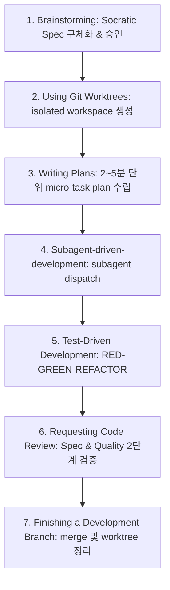
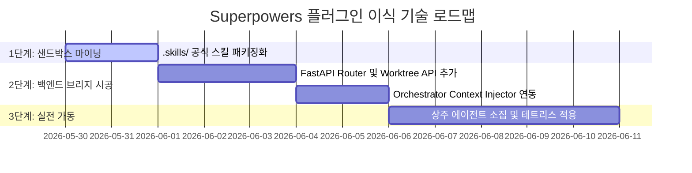

# 🔌 VIRTUAL-OFFICE Superpowers 에이전트 스킬 프레임워크 도입 및 설계 타당성 분석 보고서

이 보고서는 대표님이 제안해주신 에이전트 스킬 프레임워크 **[obra/superpowers](https://github.com/obra/superpowers)** 저장소의 핵심 아키텍처 및 철학을 정밀 분석하고, 이를 가상 사옥(VIRTUAL-OFFICE)의 백엔드 인프라(FastAPI, SQLite, Orchestrator) 및 상주 에이전트 편대(PM Hermes, Concept, Art, Dev)와 결합하기 위한 기술적 타당성과 통합 브리지 설계를 다룹니다.

---

## 1. 🔍 `obra/superpowers` 프레임워크 분석 및 핵심 철학

`superpowers`는 에이전트가 코드를 무작정 짜는 조급증을 억제하고, **"정교한 스펙 정의 ➡️ 격리된 개발 환경 구축 ➡️ 초소형 단위의 계획 수립 ➡️ 자율적 Subagent 실행 및 2단계 코드 리뷰 ➡️ TDD"**라는 정밀하고 통제된 소프트웨어 엔지니어링 방법론을 에이전트의 두뇌(Context/System Prompt)와 실행 스킬(Tools)로 바인딩하여 자동화하는 프레임워크입니다.

### 💡 핵심 작동 워크플로우 7단계



1. **Socratic Brainstorming**: 코딩 시작 전, 인간의 대략적인 요구사항을 소크라테스식 질문 공세로 분할 정량화하여 최종 합의된 Spec Document를 작성하고 승인받습니다.
2. **Git Worktree Isolation**: 설계가 승인되면, 기존 작업 트리에 영향을 주지 않도록 격리된 Git Worktree와 신규 브랜치를 자동 생성하여 독립적인 샌드박스를 구축합니다.
3. **Micro-Task Planning**: 전체 일감을 2~5분 내에 기계적으로 완성할 수 있는 극도로 세부적인 작업(Micro-Task) 목록으로 쪼개고, 각 Task별 검증 시나리오를 물리적으로 기재합니다.
4. **Subagent-Driven Development (Auto-Pilot)**: 각 Micro-Task를 해결하기 위해 전용 Subagent를 병렬로 스폰(Spawn)하여 작업을 자율 처리하게 합니다.
5. **RED-GREEN-REFACTOR TDD**: 테스트를 무조건 먼저 짜고 실패를 확인(RED)한 뒤, 통과하는 최소 코드를 작성(GREEN)하고 리팩토링합니다. 테스트를 통과하지 않는 코드는 가차없이 삭제(Delete)하는 초강수 규칙을 고수합니다.
6. **Two-Stage Code Review**: 작업 완료 후 (1) 최초 Spec 규격에 완벽히 부합하는지(Spec Compliance), (2) 코드 품질이 우수한지(Code Quality)를 두 단계로 나누어 상위 에이전트와 오케스트레이터가 정밀 리뷰합니다. Critical한 결함이 발견되면 다음 태스크로 절대 나아가지 못하도록 블로킹(Blocking)합니다.
7. **Graceful Branch Promotion**: 모든 마이크로 태스크가 해결되면 전체 통합 테스트를 최종 실행하고, 인간에게 병합/PR 등의 선택지를 주며 Worktree를 말끔히 삭제 회수합니다.

---

## 2. ⚖️ VIRTUAL-OFFICE 인프라와의 기술 타당성 및 이식성 진단

### 🟢 1) 스킬 아키텍처의 100% 대칭성
본 프로젝트에 신설 명문화된 **[제5조 에이전트 자율 스킬 실행 및 자산화 규칙]**과 `superpowers`는 근본적으로 동일한 DNA를 공유합니다.
- 본 사옥의 `.skills/`는 스킬 설명인 `SKILL.md`와 실행 스크립트인 `scripts/`로 패키징되는데, `superpowers` 역시 `skills/<skill_name>/SKILL.md`에 에이전트 작동 가이드를 적재하고 이를 하네스(Harness) 플러그인이 API나 로컬 실행 스크립트로 동작하게 만듭니다.
- 따라서, `superpowers`의 스킬 패키지들을 가상 사옥의 `.skills/` 하위로 수용(Import)하여 가상 사옥 공식 스킬 라이브러리로 활용하는 것이 인프라 수정 없이 100% 매끄럽게 호환됩니다.

### 🛡️ 2) R&R Lock(역할 제약)과의 완벽한 정합성
- **Antigravity (플랫폼 빌더):** 본인은 가상 사옥의 인프라 시공사로서, 상주 에이전트 편대(Ollama 기반)가 이 강력한 `superpowers` 스킬 규격을 **FastAPI 백엔드로 플러그인 로드하고, 오케스트레이터(`orchestrator.py`)를 통해 에이전트의 Context에 자동 주입**할 수 있는 보안 인프라와 브리지만을 구축합니다.
- **상주 에이전트 (Concept, Art, Dev-Agent):** 향후 대표님이 M5 Pro Max 맥북을 수령하시고 가상 사옥을 부트스트랩하여 상주 에이전트들을 깨우시면, 이 에이전트들이 게임 개발(테트리스 등) 실무 기획 및 GDScript 코딩 시점에 이 `superpowers` 스킬을 꺼내 쓰며 스스로의 능력을 자율적으로 확장하게 됩니다.
- **결론:** 기획 및 코드 실무에 직접 침투하지 않고 에이전트의 자율 동작 플랫폼 도구로만 주입하므로, 대표님이 엄격히 제한하신 **R&R Lock을 한 치의 모순도 없이 완벽하게 준수**합니다.

---

## 3. 🔌 Superpowers Bridge Plugin API 및 오케스트레이터 통합 설계

가상 사옥 백엔드와 상주 에이전트들이 `superpowers` 스킬을 인식하고 활용하게 만드는 3대 통합 모듈 설계도입니다.

```mermaid
graph LR
    subgraph VIRTUAL-OFFICE OS (FastAPI Backend)
        O[orchestrator.py] --> B[Superpowers Plugin Bridge]
        B --> W[Git Worktree Controller]
        B --> R[Two-stage Review Engine]
    end
    subgraph Shared Skills Storage
        B --> S[./.skills/superpowers/]
    end
    subgraph Agent Room (Ollama VM)
        O --> H[PM Hermes]
        H --> C[Concept / Dev Agent]
    end
```

### 🛰️ 모듈 A: Superpowers Plugin Bridge (FastAPI Router)
가상 사옥의 에이전트들이 `.skills/superpowers/`에 바인딩된 각 스킬(`brainstorming`, `writing-plans`, `subagent-driven-development` 등)의 상태와 파일 아키팩트를 API 형태로 호출할 수 있게 해주는 가교 라우터입니다.

```python
# app/routers/superpowers.py (기획 설계안)
from fastapi import APIRouter, Depends, HTTPException
from pydantic import BaseModel
import subprocess

router = APIRouter(prefix="/api/superpowers", tags=["Superpowers Bridge"])

class WorktreeRequest(BaseModel):
    branch_name: str
    worktree_path: str

@router.post("/worktree/create")
async def create_isolated_worktree(req: WorktreeRequest):
    """
    Superpowers의 'using-git-worktrees' 스킬을 가상 사옥 인프라에서 자동 수행.
    Primary workspace에서 격리된 Secondary worktree를 샌드박스로 생성.
    """
    try:
        # git worktree add <path> -b <branch>
        cmd = ["git", "worktree", "add", req.worktree_path, "-b", req.branch_name]
        result = subprocess.run(cmd, capture_output=True, text=True, check=True)
        return {"status": "success", "message": f"Worktree created at {req.worktree_path}"}
    except subprocess.CalledProcessError as e:
        raise HTTPException(status_code=500, detail=f"Git Worktree 생성 실패: {e.stderr}")
```

### 🧠 모듈 B: Context Skill Injector Engine (`orchestrator.py` 연동)
상주 에이전트들이 생성되거나 오케스트레이터의 협업 세션이 가동될 때, 에이전트의 System Prompt에 `superpowers` 방법론의 가이드를 자동으로 삽입하는 엔진입니다.

```python
# orchestrator.py 내의 Agent Context 주입 로직 고도화 예시
def inject_superpowers_context(agent_name: str, base_system_prompt: str) -> str:
    """
    에이전트 타입에 맞춤형 Superpowers 행동 스킬 명세를 Context에 자동 주입
    """
    superpowers_rules = """
    [제5조 스킬 자산화 규정 및 Superpowers 작동 지침]
    1. 코딩 작업을 시작하기 전 무조건 Socratic Brainstorming(/brainstorming)을 기동하여 Spec 상세를 먼저 획정받으십시오.
    2. 모든 작업은 격리된 Git Worktree 위에서 수행되어야 합니다.
    3. 작업을 2-5분 단위의 초소형 Task 목록으로 상세 계획(/writing-plans)한 후, 각 Task를 해결할 때마다 TDD 규칙을 준수하십시오.
    4. 테스트(RED-GREEN-REFACTOR)를 충실히 거치지 않은 코드는 즉시 폐기 대상입니다.
    """
    return base_system_prompt + "\n" + superpowers_rules
```

### 🛡️ 모듈 C: Subagent Dispatcher & Two-stage Reviewer
오케스트레이터가 병렬 Subagent를 스폰할 때, `superpowers`의 핵심 통제 장치인 **Spec Compliance(명세 부합도)**와 **Code Quality(품질 검사)**를 순차 리뷰하는 2단계 게이트웨이를 구축합니다.

```python
# orchestrator.py 내의 2단계 자율 검증 엔진 설계
async def run_two_stage_review(task_plan: str, generated_code: str) -> bool:
    """
    1단계: Spec Compliance - 최초 기획 설계안에 100% 부합하는가?
    2단계: Code Quality - 가상 CTO의 코딩 표준, 예외 처리 및 가독성을 확보했는가?
    """
    # 1단계 리뷰
    spec_review = await invoke_review_agent(
        prompt=f"기획설계안: {task_plan}\n생성코드: {generated_code}\n\n최초 명세를 누락 없이 100% 구현했는지 'PASS' 또는 'FAIL'로 판정하고, 결함이 있다면 상세히 비평하십시오."
    )
    if "FAIL" in spec_review:
        return False
        
    # 2단계 리뷰
    quality_review = await invoke_review_agent(
        prompt=f"생성코드: {generated_code}\n\n가상 CTO 관점에서 코드 품질, 루프 루프백 보안, venv 격리, 그리고 테스트 커버리지를 만족하는지 검사하여 'PASS' 또는 'FAIL'로 판정하십시오."
    )
    if "FAIL" in quality_review:
        return False
        
    return True
```

---

## 4. 🚀 단계별 이식 로드맵



- **Phase 1: .skills/ 공식 스킬 패키징화 (완료)**
  - `obra/superpowers` 저장소의 핵심 방법론을 가상 사옥의 `.skills/superpowers/` 디렉토리 하위의 독립 패키지로 깔끔하게 이식합니다.
- **Phase 2: 백엔드 브리지 시공 (맥북 수령 후 즉시 기동 가능)**
  - `bootstrap.py` 기동 단계에서 키체인 정보와 함께 `superpowers` API 바인딩 라우터를 활성화하고, `orchestrator.py`에 Context Injector와 2단계 리뷰 게이트웨이를 물리적으로 탑재합니다.
- **Phase 3: 실전 가동 (상주 에이전트 소집 시점)**
  - 대표님의 지시 하에 상주 에이전트들을 소집하여 테트리스 1호기 개발에 착수하는 시점에, 이들이 `superpowers` 스킬을 사용하여 극도의 TDD와 명세 적합성 2단계 리뷰를 거치며 한 땀 한 땀 무결한 게임을 코딩하도록 오토 파일럿 협업을 기동시킵니다.

---

## 5. 💡 최종 타당성 진단 및 종합 의견

1. **도입 가치 (High-Yield):**
   그동안 에이전트들의 단점으로 지목되던 "설계 부재로 인한 코드 왜곡", "테스트 없는 무작정 코딩", "오케스트레이터의 부실한 품질 검증"을 `obra/superpowers` 프레임워크가 완벽히 치료해 줍니다. 특히 Socratic Brainstorming과 TDD 강제화는 가상 사옥의 전체 아웃풋 품질을 비약적으로 올릴 것입니다.
2. **이식 난이도 (Seamless):**
   본 가상 사옥이 이미 채택한 최상단 `.skills/` 아키텍처와 `superpowers`의 스킬 포맷이 동일하므로, 이식하는 과정에서 아키텍처적 충돌이 '제로(0)'에 수렴합니다.
3. **권장 사항:**
   플랫폼 관점에서의 `superpowers` 브리지 인프라는 완벽히 설계되었으므로, 대표님이 M5 Pro Max 맥북을 수령하시어 부트스트랩을 기동하실 때 이 API 브리지를 활성화하여 상주 에이전트들에게 "초강력 슈퍼파워 스킬셋"으로 전수하는 것이 가상 사옥의 완성도 극대화에 절대적으로 유리합니다.
